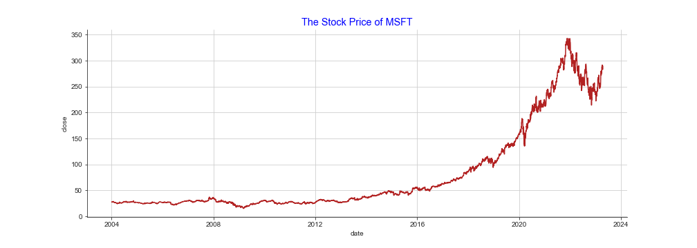
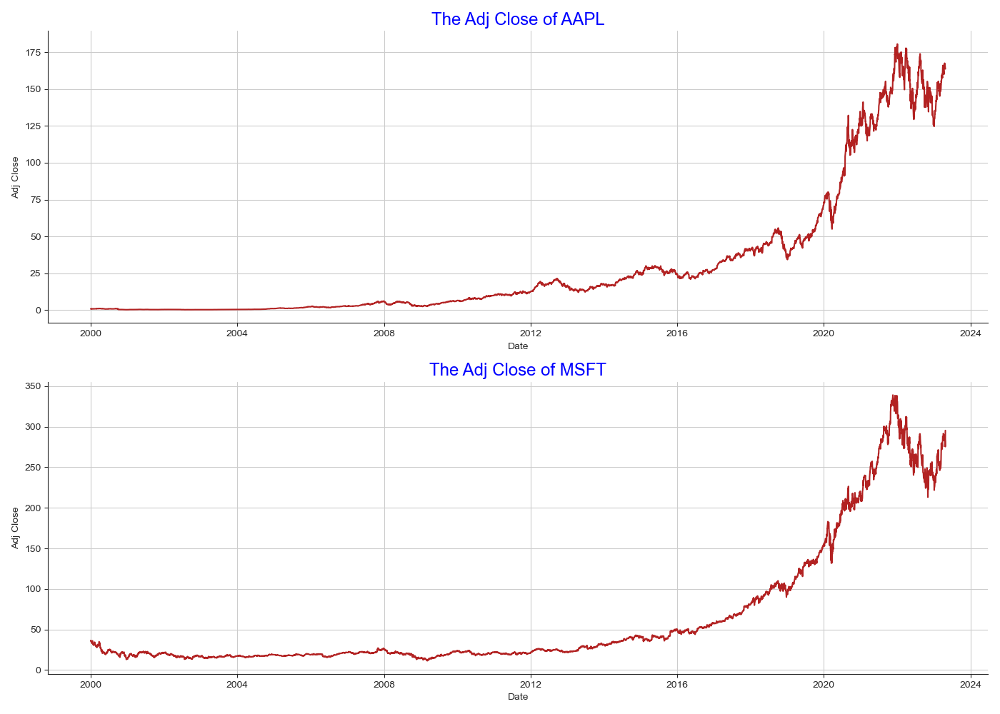

# visualization
Plot stock close price using matplotlib+seaborn and plotly.  
Functions for plotting single and multiple graphs are provided.  
Also, you can check the plot results with jupyter notebook.

## Results
### matplotlib + seaborn
* single plot  

* multiple plot  

